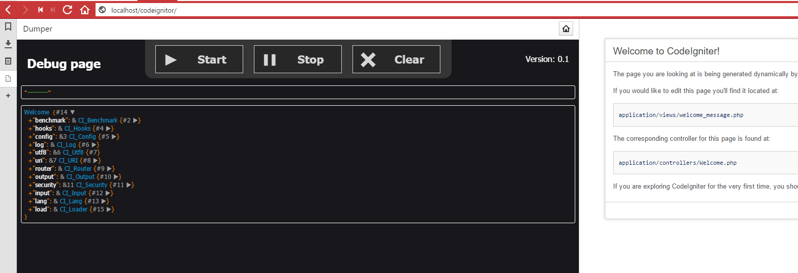
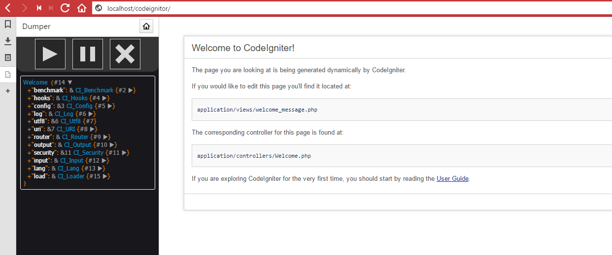

# php-dump
=============
This is a application that simple dump dumps in a separate web page

## Installation
 1. Clone this project on your development server on /var/phpdump/repositories
 2. Run composer install in project map
 3. Create config.yml, Example file: example.yaml-example
 5. Create host_vars file for your environment for ansible
 4. Run ansible to set your server to the correct state.
 

**Functions:**
- (start) Start pulling for new dumps 
- (stop) Stop pulling for new dumps
- (clear) Clear current page from all dumps

**Example debug pages:**

