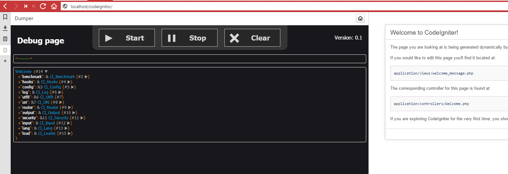
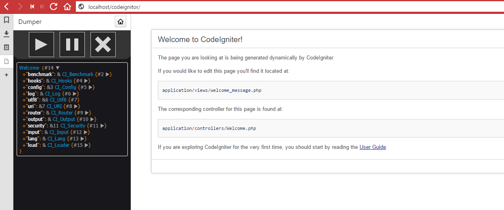

# php-dump
=============
This is a application that simple dump dumps in a separate web page

[](https://php.net/)
## Installation
 1. Clone this project
 2. Run composer install in project map
 ```bash
 $ composer install
 ```
  3. Check if the index.html is accessible throw your browser.

## Enable
### In one project
start of project: (index or bootstrap file)
```php
require 'path/to/project/php-dump/project/vendor/autoload.php';
```
### Global on server
```bash
$  echo 'auto_prepend_file = "/location/of/this/project/vendor/autoload.php"' >> /path/to/php/include/ini/files/php-debug.ini
```

**Functions:**
- (start) Start pulling for new dumps 
- (stop) Stop pulling for new dumps
- (clear) Clear current page from all dumps

**Example debug pages:**


